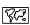
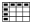

# Introduction
This jupyter book is made for the Hawaiian Island region. Click on the following links to access the output or detailed code for each sea level indicator. You may also jump straight to the [table of contents of currently available sections](#table-of-contents).

## Regional and Local
````{margin}
```{note}
Click on the icons below to access products. Downloadable content is indicated with a small download icon.

**Key:** 

 (Maps), 

 (Plots), 

 (Tables), 

 (Text)
```
````


| Indicator | Historical |          | Outlook/Projections |
|---|:---:|--|:---:|
| **1.0 Sea Level Magnitude** |  |  |
| 1.1 Sea Level Trend | [](output/SL_magnitude_map.png) [](output/SL_magnitude_timeseries.png) [](output/SL_magnitude_results.csv) [](notebooks/regional_and_local/SL_magnitude.ipynb) | |   [](note) |
| 1.2 Sea Level Anomaly: Annual |     | |    |
| 1.2 Sea Level Anomaly: Intra-Annual | [](output/SL_anomaly_map.png) [](output/SL_anomaly_timeseries_stations.png)   | |    |
| 1.3 Rankings: Annual  |    ||     |
| 1.3 Rankings: Intra-Annual |     | |    |
| 1.4 Extremes: Annual |     | |    |
| 1.4 Extremes: Intra-Annual |     | |    |
| 1.5 Components: Annual |     | |    |
| 1.5 Components: Intra-Annual |     | |    |
| **2.0 Flood Frequency and Duration** |  |  |
| 2.1 Minor Flood Frequency: Annual |     | |    |
| 2.1 Minor Flood Frequency: Intra-Annual |     | |    |
| 2.2 Flood Duration |     | |    |


```{tableofcontents}
```

