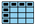

# Introduction
This jupyter book is made for sea level indicators of the Hawaiian Island region. Click on the following links to access the output or detailed code for each sea level indicator. You may also jump straight to the [table of contents of currently available sections](#table-of-contents).

````{margin}
```{note}
Click on the icons below to jump to the product's notebook. Downloadable content is indicated with color.

**Key:** 

 **Maps** 

 **Plots** 

 **Tables** 

 **Text**
```
````
***

## Products
::::{grid}

:::{grid-item}
:columns: 6
**Indicator**
:::
:::{grid-item}
:columns: 3

**Historical**
:::
:::{grid-item}
:columns: 3
**Projections**
:::

---

:::{grid-item}
:columns: 12
**1.0 Sea Level Magnitude**
:::

:::{grid-item}
:columns: 1
:::
:::{grid-item}
:columns: 5
1.1 Sea Level Trend 
:::
:::{grid-item}
:columns: 3
[](notebooks/regional_and_local/SL_magnitude.ipynb#create-a-map) [](notebooks/regional_and_local/SL_magnitude.ipynb#create-a-time-series-plot) [](notebooks/regional_and_local/SL_magnitude.ipynb#create-a-table)  [](notebooks/regional_and_local/SL_magnitude.ipynb) 
:::
:::{grid-item}
:columns: 3
    
:::

:::{grid-item}
:columns: 1
:::
:::{grid-item}
:columns: 11
1.2 Sea Level Anomaly
:::

:::{grid-item}
:columns: 2
:::
:::{grid-item}
:columns: 4
a. Annual
:::
:::{grid-item}
:columns: 3
[](notebooks/regional_and_local/SL_anomaly_annual.ipynb#create-a-map) [](notebooks/regional_and_local/SL_anomaly_annual.ipynb#create-a-time-series-plot)   [](notebooks/regional_and_local/SL_anomaly_annual.ipynb) 
:::
:::{grid-item}
:columns: 3
    
:::

:::{grid-item}
:columns: 2
:::
:::{grid-item}
:columns: 4
b. Intra-Annual
:::
:::{grid-item}
:columns: 3
    
:::
:::{grid-item}
:columns: 3
    
:::

:::{grid-item}
:columns: 1
:::
:::{grid-item}
:columns: 11
1.3 Rankings
:::

:::{grid-item}
:columns: 2
:::
:::{grid-item}
:columns: 4
a. Annual
:::
:::{grid-item}
:columns: 3
[](notebooks/regional_and_local/SL_Rankings.ipynb#create-a-map) [](notebooks/regional_and_local/SL_Rankings.ipynb#make-timeseries-plots) [](notebooks/regional_and_local/SL_Rankings.ipynb#style-the-table)  [](notebooks/regional_and_local/SL_Rankings.ipynb) 
:::
:::{grid-item}
:columns: 3
    
:::


:::{grid-item}
:columns: 2
:::
:::{grid-item}
:columns: 4
b. Intra-Annual
:::
:::{grid-item}
:columns: 3
    
:::
:::{grid-item}
:columns: 3
    
:::

:::{grid-item}
:columns: 1
:::
:::{grid-item}
:columns: 11
1.4 Extremes
:::

:::{grid-item}
:columns: 2
:::
:::{grid-item}
:columns: 4
a. Annual
:::
:::{grid-item}
:columns: 3
    
:::
:::{grid-item}
:columns: 3
    
:::

:::{grid-item}
:columns: 2
:::
:::{grid-item}
:columns: 4
b. Intra-Annual
:::
:::{grid-item}
:columns: 3
    
:::
:::{grid-item}
:columns: 3
    
:::

:::{grid-item}
:columns: 1
:::
:::{grid-item}
:columns: 11
1.5 Components
:::

:::{grid-item}
:columns: 2
:::
:::{grid-item}
:columns: 4
a. Annual
:::
:::{grid-item}
:columns: 3
    
:::
:::{grid-item}
:columns: 3
    
:::

:::{grid-item}
:columns: 2
:::
:::{grid-item}
:columns: 4
b. Intra-Annual
:::
:::{grid-item}
:columns: 3
    
:::
:::{grid-item}
:columns: 3
    
:::

:::{grid-item}
:columns: 12
**2. Minor Flood Frequency and Duration**
:::

:::{grid-item}
:columns: 1
:::
:::{grid-item}
:columns: 11
2.1 Indicator: Minor Flood Frequency
:::

:::{grid-item}
:columns: 2
:::
:::{grid-item}
:columns: 4
a. Annual
:::
:::{grid-item}
:columns: 3
[](notebooks/FloodFrequency.ipynb#create-a-map) [](notebooks/FloodFrequency.ipynb#plot-time-series-of-all-stations) [](notebooks/FloodFrequency.ipynb#create-a-table)  [](notebooks/FloodFrequency.ipynb)  
:::
:::{grid-item}
:columns: 3
    
:::

:::{grid-item}
:columns: 2
:::
:::{grid-item}
:columns: 4
b. Intra-Annual
:::
:::{grid-item}
:columns: 3
    
:::
:::{grid-item}
:columns: 3
    
:::

:::{grid-item}
:columns: 1
:::
:::{grid-item}
:columns: 11
2.2 Indicator: Flood Duration
:::

:::{grid-item}
:columns: 2
:::
:::{grid-item}
:columns: 4
a. Annual
:::
:::{grid-item}
:columns: 3
    
:::
:::{grid-item}
:columns: 3
    
:::

:::{grid-item}
:columns: 2
:::
:::{grid-item}
:columns: 4
b. Intra-Annual
:::
:::{grid-item}
:columns: 3
    
:::
:::{grid-item}
:columns: 3
    
:::


::::

***
## Table of Contents

```{tableofcontents}
```

